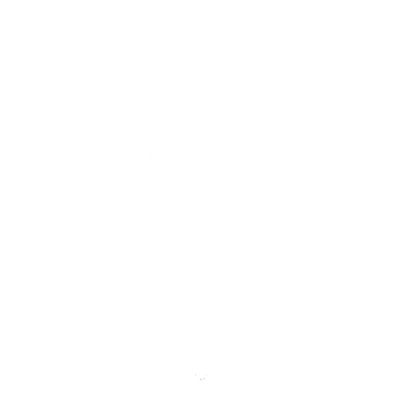
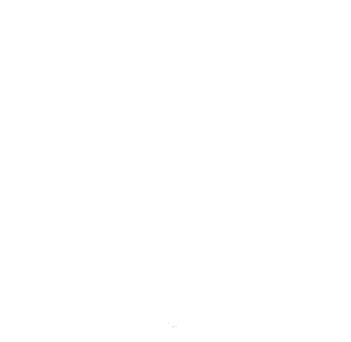
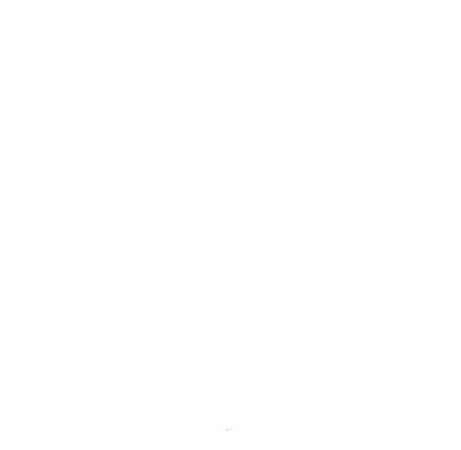
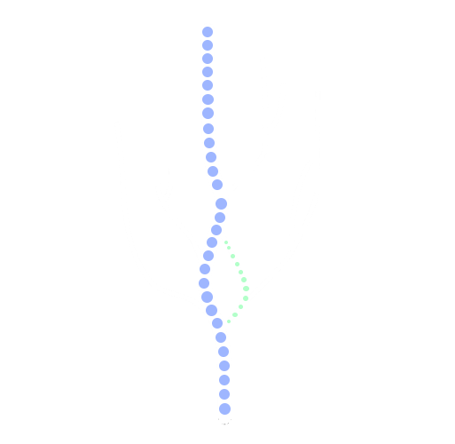
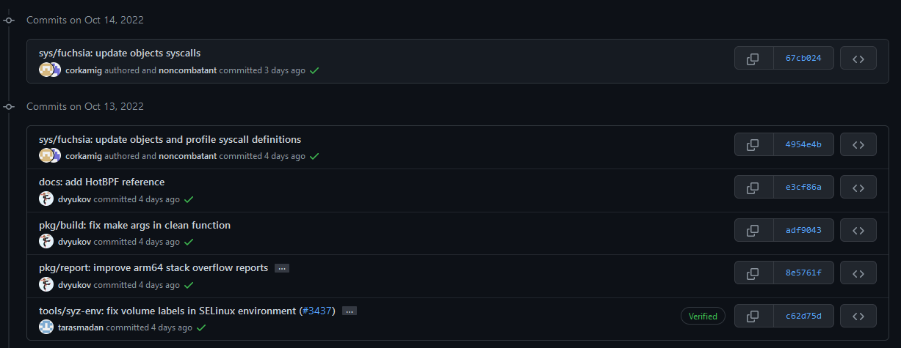

### Git Gud
#### A Dummies Guide to Git
Note:

What is Git?
Note: Something

Git is a **version control system**
Note: something else

### Version Control System

Version control is the practice of **tracking** and **managing changes** to software code.

### But why version control?
- long term change history for each file in your project <!-- .element: class="fragment" data-fragment-index="1" -->
- make developer collaboration easier with branching and merging <!-- .element: class="fragment" data-fragment-index="2" -->

Wait a minute... is this what GitHub/GitLab is?

## **NO**

GitHub and GitLab allow you to host your git repositories on their remote servers.

They're providing a service. <!-- .element: class="fragment" data-fragment-index="1" -->

Before we go any further...

The tree analogy

Where do I get git?

##### [https://git-scm.com/downloads](https://git-scm.com/)
Linux users - you probably have this pre-installed

Basic Git

What is a repository?

- Just a folder on your computer.
- All versions of your code lie in this special folder.
- You can either make your own repo, or clone an existing one

How to make a new repo?  

`git init`   <!-- .element: class="fragment" data-fragment-index="1" -->

Git will now track your current working directory <!-- .element: class="fragment" data-fragment-index="2" -->

`git clone <git link for repo>`

This will download a version of the repository as a new folder on your computer <!-- .element: class="fragment" data-fragment-index="1" -->

**Staging**  

Combining related changes, and preparing them for a commit <!-- .element: class="fragment" data-fragment-index="1" -->

`git add [file/files/wildcard expansion]`

What is a commit?
- Documents changes made to a file line-by-line <!-- .element: class="fragment" data-fragment-index="1" -->
- they hold information about: <!-- .element: class="fragment" data-fragment-index="2" -->
    - a unique commit hash for each commit <!-- .element: class="fragment" data-fragment-index="3" -->
    - edited lines <!-- .element: class="fragment" data-fragment-index="4" -->
    - description from the committer explaining the change <!-- .element: class="fragment" data-fragment-index="5" -->

`git commit`  

Presents you with a text editor to write your commit message. <!-- .element: class="fragment" data-fragment-index="1" -->

On saving, your work is committed <!-- .element: class="fragment" data-fragment-index="2" -->

What if I staged a file by accident?  

`git reset [file]` <!-- .element: class="fragment" data-fragment-index="1" -->

One of the biggest advantages of git is being able to see your previous commits, and commit history
- you can revert to a previous version of the code
- check commit messages, to see the reasoning for a change
    - so essentially, your git repo is only as good as the commit messages you write

Bad Commit History

Good Commit History

Guide to writing good commits:  
[https://conventionalcommits.org](https://conventionalcommits.org)

Branching  
- the default branch is "main"
- `git checkout -b <branchname>` will make a new branch 
- to switch between branches use `git checkout <branchname>` 
- to view your current branch, use `git branch`

Merging
- since we now have branches with different features, we eventually need these features to come back to our production feature
- `git merge <branchname>` will merge `branchname` into the branch you are currently on.
- you could get a merge conflict
    - to fix merge conflicts, go to the file with the conflict, and resolve it (keep the version you want) and then stage the file once again.

Live Demo on GitHub 